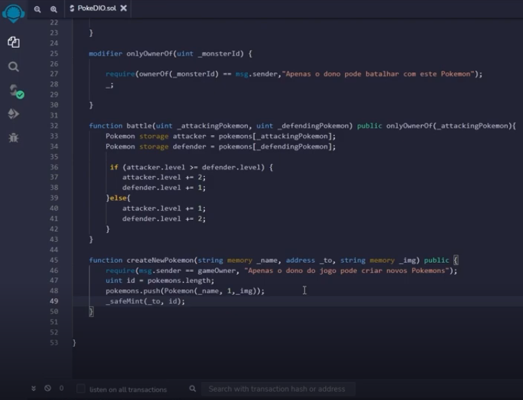
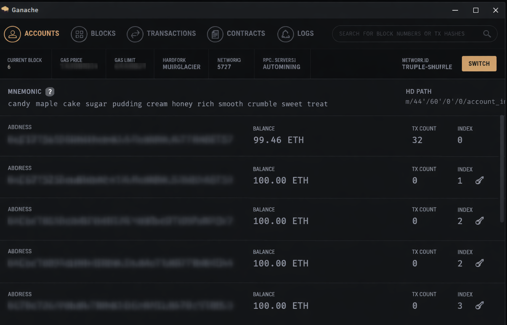
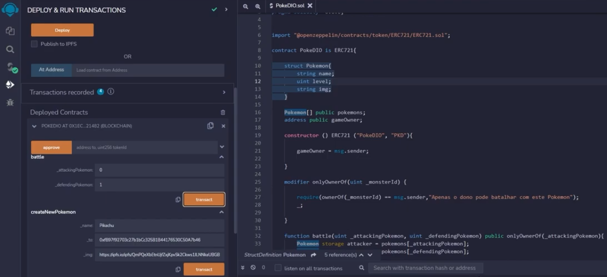
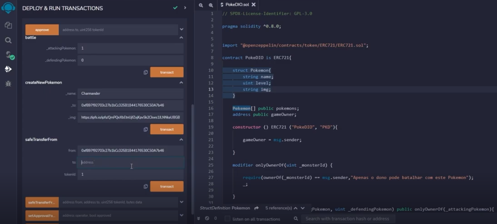

Daily learning

# Create your own Pokémon NFT with Blockchain

Project developed at the Bootcamp Blockchain Specialist Training, under the guidance of specialist [Cassiano Peres](https://github.com/cassianobrexbit/ "Cassiano Peres").
We will use Solidity to develop our NFT token in the ERC-721 standard, simulating a Pokémon battle game.

Technologies used:

- [Solidity](https://www.soliditylang.org/)
- [Ganache](https://archive.trufflesuite.com/ganache/)
- [Remix IDE](https://remix.ethereum.org/#lang=en&optimize&runs=200&evmVersion&version=soljson-v0.8.34+commit.80d5c536.js)
- [Metamask](https://chromewebstore.google.com/detail/metamask/nkbihfbeogaeaoehlefnkodbefgpgknn)
- [IPFS](https://ipfs.tech/)

Challenge steps:

1. Implement the ERC-721 token

2. Publish on the blockchain

3. Conduct "battles" with Pokémon

4. Transfer NFTs between accounts

[LICENSE](/LICENSE)

See [original repository](https://github.com/cassianobrexbit/bitcoin-dio)
